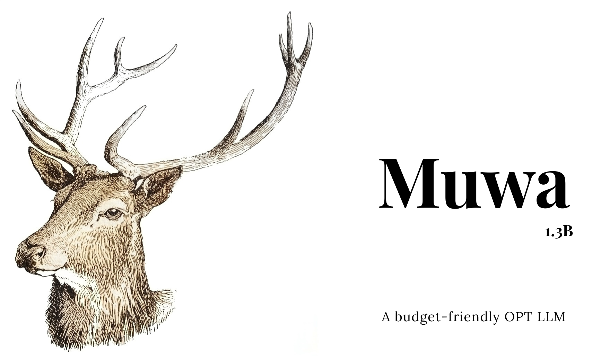

# Muwa-OPT - A budget-friendly OPT-based LLM 

[Muwa Repository on HuggingFace](https://huggingface.co/theSLWayne/Muwa-1.3b)



Muwa is a fine-tuned LoRA model based on Facebook's OPT model architecture. Muwa was fine-tuned using the [databricks-dolly-15k](https://huggingface.co/datasets/databricks/databricks-dolly-15k), which is a dataset of instruction-following records that belong to multiple categories like brainstorming, classification, closed QA, generation, information extraction, open QA, and summarization. **The specialty of Muwa is that only free resources have been used to fine-tune the model**, no fancy arrays of GPUs or paid GPU processors were not used for fine-tuning the model; only the free-tier of Google Colaboratory.

Muwa is currently trained using the [OPT 1.3b model](https://huggingface.co/facebook/opt-1.3b), which is available in HuggingFace. 

This work is heavily inspired from [Yudhanjaya's Eluwa model](https://github.com/yudhanjaya/Eluwa). Most of the model fine-tuning and benchmarking code is taken from their repository and I made some adjustments to the code and changed some parameters to make sure that the fine-tuning process can be done on free resources that were available to me at the time.

## Inference

Make sure you install the following Python packages in the environment where the model is intended to be run.

```shell
pip install torch peft datasets evaluate transformers accelerate bitsandbytes
```

First, OPT 1.3b model should be loaded and then Muwa should be loaded from their respective HuggingFace repositories. After the models are loaded, they can be used for inference.

```python
import torch
from peft import PeftModel, PeftConfig
from transformers import AutoModelForCausalLM, AutoTokenizer, pipeline

# Define model names to be loaded
peft_model_id = 'theSLWayne/Muwa-1.3b'
base_model = 'facebook/opt-1.3b'

# Load base model
model = AutoModelForCausalLM.from_pretrained(
            base_model,
            device_map='auto',
            torch_dtype=torch.float16,
        )

# Load Muwa
model = PeftModel.from_pretrained(
            model,
            peft_model_id,
            device_map='auto',
            torch_dtype=torch.float16,
        )

# Initiate tokenizer of the base model
tokenizer = AutoTokenizer.from_pretrained(base_model)

# Create batches of inputs
batch = tokenizer("What is a deep learning model?", return_tensors='pt')

# Take predictions
with torch.cuda.amp.autocast():
  output_tokens = model.generate(**batch, max_new_tokens=50)

print(tokenizer.decode(output_tokens[0], skip_special_tokens=True))
```

If you intend to use CPU (which is not recommended), you can load the models as follows:

```python
model = AutoModelForCausalLM.from_pretrained(
            base_model, device_map='auto', low_cpu_mem_usage=True
        )

model = PeftModel.from_pretrained(
            model,
            peft_model_id,
            device_map='auto',
        )
```

## Training Muwa

This model was fine-tuned for 2 Epochs using the aforementioned Databricks Dolly 15K dataset. This model and its base model (OPT 1.3b) can be loaded in 8-bit. The notebook that was used for training this model can be found on this repo, including my notes on each code block.

The model was trained only using T4 GPU provided by Google Colab. **In order to fit the whole model and the dataset into it, the dataset had an input limit of 1024 tokens per each query**. **This was done because with the default value, the GPU RAM was not enough to fine-tune the model**.

With the limit in input tokens, the model training took ~12 GB of GPU RAM.

### PEFT and LoRA  

PEFT(Parameter-Efficient Fine-tuning) is a set of approaches that are meant to reduce the cost of fine-tuning, storing, and deploying large models. According to [this HuggingFace article on PEFT](https://huggingface.co/blog/peft), 

*`PEFT approaches only fine-tune a small number of (extra) model parameters while freezing most parameters of the pretrained LLMs, thereby greatly decreasing the computational and storage costs. This also overcomes the issues of catastrophic forgetting, a behaviour observed during the full finetuning of LLMs. PEFT approaches have also shown to be better than fine-tuning in the low-data regimes and generalize better to out-of-domain scenarios. It can be applied to various modalities, e.g., image classification and stable diffusion dreambooth.`*

HuggingFace has launched a Python package with the same name and according to the documentation it implements a number of PEFT methods:

1. LoRA
2. Prefix Tuning
3. P-Tuning
4. Prompt Tuning
5. AdaLoRA

This package is used in fine-tuning and in the inference of Muwa. More details about this package can be discovered [here](https://github.com/huggingface/peft).

LoRA (Low-Rank Adaptation) is a method proposed for adapting large pre-trained language models to specific tasks or domains. It involves freezing the pre-trained model weights and adding trainable rank decomposition matrices to each layer of the Transformer architecture, which significantly reduces the number of trainable parameters for downstream tasks. This approach allows for efficient adaptation of language models with fewer trainable parameters and reduced GPU memory requirements. More information on LoRA can be found on the paper that introduced the method, which can be accessed [here](https://arxiv.org/abs/2106.09685). Also, I found [this video](https://www.youtube.com/watch?v=_K3HgjnRHCY&lc=Ugyqpr8yVUW2DHlvsoZ4AaABAg) that explains the paper in simple terms, which I found to be very useful.

## Testing and Evaluating

Muwa was tested and evaluated using SQuAD mini, wikitext, and piqa datasets. Both Muwa and its base model, OPT 1.3b were evaluated seperately using all mentioned datasets and the results can be summarized as follows:

| Dataset | OPT 1.3b | Muwa |
|---------|----------|------|
| SQuAD Mini (*avg. f1 score*) | 24.587 | **26.234** |
| wikitext (*perplexity*) | 13.91406 | **13.96875** |
| piqa (*accuracy*) | 0.495 | **0.532** |

As shown, Muwa has been able to outperform its base model by fine tuning using a rather smaller dataset (compared to others like [Alpaca](https://huggingface.co/datasets/tatsu-lab/alpaca) available for these tasks) for all the evaluation datasets. 

This shows that LLMs that have Billions of parameters can be fine-tuned using resources which are available for free and you can actually improve the model's performance by doing so.

Code used for evaluating Muwa can be found in the notebook which is included in this repo.

## The Story Behind Muwa

As mentioned above, Muwa was heavily inspired by Eluwa model developed by Yudhanjaya et al. "Eluwa" means goat in Sinhalese. Continuing the trend of naming LLMs after even-toed ungulates, this model is named "Muwa".

Deers aren't as fearsome as Goats, or even Llamas and alpacas but they are still an impressive species. They are graceful, agile, and known for their antlers, which they shed and regrow every year. In some cultures, deers are considered a symbol of gentleness and kindness. All the more reasons to name this model after them.

About the graphic located at the beginning of this document, that is the work of someone(me) with zero knowledge and experience in design, and it shows. The initial image was taken from [freepngimg.com](https://www.freepngimg.com/png/22758-deer-head-free-download) and is protected under [Creative Commons (CC BY-NC 4.0)](https://creativecommons.org/licenses/by-nc/4.0/) license. Then that image was colorized using [Colorizer Models HuggingFace space](https://huggingface.co/spaces/trysem/Colorizer_Models). Then the text was added after loading the colorized image into [Canva](canva.com), which provided the final output.

## License

The base model used for this work, Facebook's OPT has its own license, which can be found [here](https://github.com/facebookresearch/metaseq/blob/main/projects/OPT/MODEL_LICENSE.md). 

Databricks Dolly 15k model is protected under [CC BY-SA 3.0](https://creativecommons.org/licenses/by-sa/3.0/), allowing it to be modified, redistributed, and used for any purpose, even commercially.

Although the dataset is allowed to be modified and redistributed, the licensing of OPT does not allow to use it for any commercial or any other non-research related cases, therefore making Muwa restricted to be used only for research, under CC BY NC 4.0.